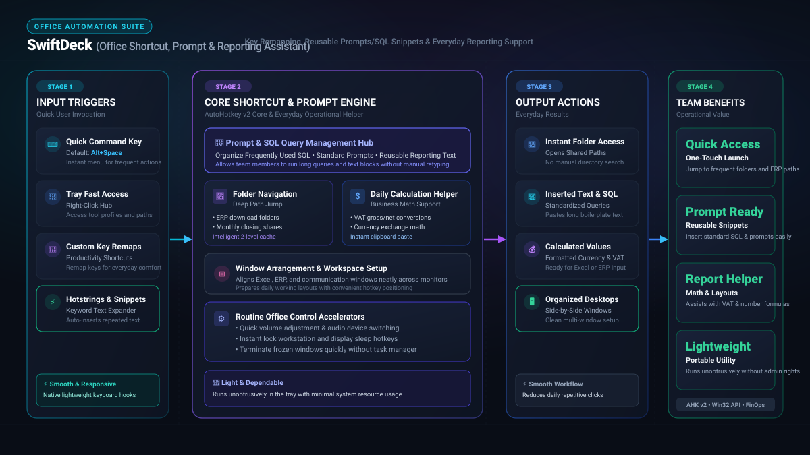

*Read this in other languages: [English](README.md), [한국어](README.ko.md), [Polski](README.pl.md)*

# ⚡ SwiftDeck: Office Shortcut & Prompt Automation Suite

<p align="center">
  
</p>

> **Key Remapping · Frequent Prompts & SQL Snippets · Reporting Workflow Support**

**SwiftDeck** is a practical Windows desktop productivity tool designed to help team members handle routine operational tasks more efficiently.

In daily office administration and reporting, workers repeatedly navigate deep network folder paths, run recurring SQL/ERP queries, and paste standard text prompts. SwiftDeck organizes these repetitive actions into quick hotkey shortcuts (Alt + Space), enabling users to jump to frequently used workspaces, insert standard report templates, and perform everyday calculations conveniently without repetitive clicks.

## Core Features

- **📂 1-Click Folder Navigation**: Open frequently used folders, ERP download paths, monthly evidence folders, and shared network drives from a hotkey menu. Supports subfolder browsing up to 2 levels deep with an intelligent cache.
- **⌨️ Prompt & SQL Text Automation**: Run long text blocks, SQL queries, AI prompts, or control-key sequences such as `{Enter}`, `{Tab}`, `{Wait:500}`, and `Ctrl+S`.
- **📋 Quick Prompt Popup Menu**: Press `Shift + Win + Space` to instantly display all registered prompts in a popup menu at your mouse cursor position — no need to remember individual slot numbers.
- **✏️ Hotstrings**: Expand short abbreviations into full email templates, reporting phrases, symbols, or standard messages instantly after a space or Enter key.
- **🔀 Key Remapping**: Remap rarely used keys such as CapsLock into practical shortcuts, mouse clicks, or workflow-specific actions.
- **⚙️ Portable Team Deployment**: Share local `.ini` settings files to standardize folder paths, prompts, and templates across a team with zero installation.

---

## 🚀 Download & Installation (One-Click Installer)

**SwiftDeck** is distributed as a **standard per-user Windows installer (`App02_SwiftDeck_Setup_vX.Y.Z.exe`)**, which requires NO administrator privileges (UAC elevation) and installs cleanly on corporate PCs.

### 📥 One-Click Installation Guide

1. Go to the **[Releases](https://github.com/KwangBeomPark/02_SwiftDeck/releases)** tab on GitHub.
2. Download the latest installer **`App02_SwiftDeck_Setup_vX.Y.Z.exe`**.
3. Run the installer. It will automatically install to `%LOCALAPPDATA%\Programs\SwiftDeck` without requiring UAC approval.
4. Legacy shortcuts and Run registry keys will be cleanly removed, while your custom settings (`UserSetting\config.ini`) are strictly preserved across updates and uninstallation.
5. Launch SwiftDeck from the Start Menu, Desktop shortcut, or system tray.

### 🛡️ What Windows Will Say

**From v1.4.0, SwiftDeck releases are code-signed.** The executables carry an Authenticode signature from a Certum open-source developer certificate issued to the author, SHA-256 and timestamped, so Windows can tell you who published the file and confirm the bytes have not been altered since.

That changes what you should expect:

| Protection | What happens |
| --- | --- |
| **Smart App Control** | The app **runs**. Measured on a machine with Smart App Control in enforcing mode: the signed v1.4.0 build started normally, where the unsigned build of the same app had been blocked outright. |
| **SmartScreen** | May still show "Windows protected your PC" on early downloads. The certificate is new, and SmartScreen reputation is earned per certificate over downloads. Click **More info**, check that the publisher reads **Open Source Developer KWANG BEOM PARK**, then **Run anyway**. |
| **Antivirus or company policy** | Can still quarantine or block by its own rules. Ask your IT team to allow it. |

**Verify the publisher before you run it.** Right-click the `.exe` → **Properties** → **Digital Signatures**. The **Name of signer** column should read `Open Source Developer KWANG BEOM PARK`. Select the signature → **Details** → **View Certificate**, and the **General** tab should show:

```text
Issued to:  Open Source Developer KWANG BEOM PARK
Issued by:  Certum Code Signing 2021 CA
```

If the **Digital Signatures** tab is missing, or the name differs, the file is not the one published here — delete it.

**If your machine still blocks it**, the signature is what makes this fixable: ask your IT team to allow SwiftDeck by publisher. They can confirm exactly who signed it from the certificate above, which is not something they could do for an unsigned download.

Running from source also works in many environments — install [AutoHotkey v2](https://www.autohotkey.com/) and run `src/SwiftDeck.ahk`. Be aware of what that does and does not buy you: AutoHotkey ships its interpreter **unsigned**, so this route works where Windows already trusts that widely-used binary, but it will not get you past a strict WDAC or AppLocker publisher allowlist — under those rules an unsigned interpreter is exactly what gets blocked, and the signed SwiftDeck executable is the better thing to ask for.

Either way, do not turn Smart App Control off to work around a block: it is a **one-way change**, and Windows cannot switch it back on without reinstalling the operating system.

### 🔍 Verifying Your Download

The installer signature and SHA-256 digest are separate checks. Each new release includes `SHA256SUMS.txt` and `build-manifest.json`:

```powershell
Get-FileHash .\App02_SwiftDeck_Setup_v1.4.2.exe -Algorithm SHA256
```

The printed hash must match the line for that filename in `SHA256SUMS.txt`. If it does not, delete the file and download it again.

### 🔄 Automatic Updates

SwiftDeck v1.4.2 and later use the installer metadata in `build-manifest.json`, validate the product/version/name/size/SHA-256, and launch the installer only after trusted timestamped signatures and matching publisher certificates are verified. Settings in UserSetting remain protected by the installer. Versions 1.3.1, 1.4.0 and 1.4.1 need a first manual upgrade to this installer-only release. Source mode, read-only locations, certificate rotation, or blocked signature verification require manual installation. Existing releases retain their original file names; the new name takes effect only when v1.4.2 is published.

### 🛠️ For Power Users & Developers (Custom Build)

1. Install [AutoHotkey v2](https://www.autohotkey.com/).
2. Clone this repository.
3. Customize `src/SwiftDeck.ahk` as needed.
4. Run `scripts/build.ps1` to compile, package, and write the update manifest.

To produce a signed build, import your code-signing certificate into your personal
certificate store and pass its thumbprint:

```powershell
.\scripts\build.ps1 -CertificateThumbprint <thumbprint>
```

Signing runs before the SHA-256 is written into `build-manifest.json`, so a signed
build stays verifiable by the updater. Without the parameter the build is unsigned.

Before publishing, exercise the self-update path against the previous release:

```powershell
.\tests\Test-UpdateWorker.ps1 -OldExe dist\SwiftDeck.v1.3.1.exe -NewExe release\SwiftDeck.v1.4.0.exe -WorkRoot $env:TEMP
.\tests\Test-UpdateRollback.ps1 -OldExe release\SwiftDeck.v1.4.0.exe -WorkRoot $env:TEMP
```

### Repository Layout

```text
src/      Source entry point and AutoHotkey library files
tests/    Test suites; scripts/build.ps1 runs every tests/*Tests.ahk and fails the build on any failure
scripts/  Build, packaging, signing, and optional release publishing
assets/   Public images, icons, and README media
dist/     Local build output (.exe only), excluded from Git
release/  One signed App02 installer, SHA256SUMS.txt and build-manifest.json; excluded from Git
```

Release binaries should be uploaded to GitHub Releases, not committed to the repository body.

---

## 💼 Practical FinOps & Business Use Cases

- **Month-end closing folder access**: Press `F1` to open a menu of monthly closing folders, ERP downloads, evidence files, and shared drives — all within one click.
- **SQL / AI prompt execution**: Press a registered shortcut or open the Quick Prompt Menu (`Shift + Win + Space`) to type any stored AI prompt or SQL query automatically.
- **Standard email templates**: Type a short hotstring such as `;t1` to expand it instantly into a full report message, budget request, or daily cash update.
- **Quick Prompt Popup**: Browse and launch all prompts slot-by-slot from a popup menu at your mouse cursor — ideal for users managing multiple AI prompt libraries.
- **Fatigue reduction**: Remap repetitive keyboard or mouse operations to reduce wrist strain during long Excel, ERP, or copy-paste work sessions.
- **Team standardization**: A manager can configure common prompts, folder paths, and hotstrings once, then distribute the generated `.ini` files to bring the whole team onto the same workflow standard.

---

## 📖 User Manual

✔ **Folders**: Manage and quick-jump to frequently used folder paths. Subfolders are browsable up to 2 levels deep.  
✔ **Prompts**: Execute repetitive text strings and control-key macros such as `{Wait}`, `{Enter}`, and `{Tab}`. Supports `{Ctrl+S}`, `{Alt+Tab}`, and other shortcut combos.  
✔ **Hotstrings**: Register text abbreviations for instant auto-completion triggered by a space or Enter key.  
✔ **Key Remap**: Map physical keys to more useful shortcuts or mouse clicks.  
✔ **General**: Manage hotkeys, Windows startup, the settings folder, saved-setting backups, restore, and factory reset.<br>
✔ Changes in **Folders**, **Prompts**, **Hotstrings**, and **Key Remap** are saved and applied immediately after each confirmed action. Only **General** keeps **Save & Apply** because its hotkey values are edited as a set. Closing or exiting with pending General changes offers **Save All**, **Discard**, or **Keep Editing**.

> Open **App Settings → Manual** for the built-in guide. Its shortcut summary is generated from the settings currently active on your PC, and the last selected manual language is restored the next time you open it.

---

## ⌨️ Essential Shortcuts & Controls

| Shortcut | Function |
|---------|----------|
| `F1` (Default) | Open the Favorite Folders popup menu from anywhere |
| `Win + Numpad (0~9)` | Execute registered prompt slots directly by number |
| `Shift + Win + Space` | Open the **Quick Prompt Popup Menu** at mouse position |
| `Ctrl + Win + Space` | Open the emoji and symbol picker |
| `Ctrl + F1` (Default) | Add the current Explorer folder to Favorites. If the Favorites hotkey changes, SwiftDeck derives and displays a non-conflicting related shortcut. |
| `;abbreviation` e.g. `;t1` | Expand a hotstring into long text or an email template |
| `System Tray Menu` | Open App Settings and related management menus |

---

## ⚙️ Settings File & Team Deployment

SwiftDeck stores active settings in `UserSetting` beside the executable or source entry point: `config.ini` for general shortcuts and four feature INI files. Existing Roaming settings are copied once with verification; destination settings win and originals remain. Legacy registry values are copied only when missing.

You can open the settings folder from:

```text
System Tray Menu → Open Settings Folder
```

The same actions are available in **App Settings → General → Data, Startup & Recovery**:

- **Open Folder** opens the local settings directory.
- **Backup Saved** backs up the five configuration INI files currently stored on disk. If General shows pending changes, apply them first.
- **Restore** confirms before replacing the current configuration and then reloads SwiftDeck. Older four-file backups also restore their general shortcuts into config.ini.
- **Factory Reset** preserves backups but replaces active settings with defaults after confirmation.

**If Restore is not enough.** SwiftDeck refreshes `Backups\<file>.bak` every time it starts, so if a problem is only noticed after a restart, that copy already reflects the problem. Before overwriting it, the previous `.bak` is kept as `Backups\<file>.bak.YYYYMMDD`, one per day and five days in total. **Restore** only uses the plain `.bak`; to go further back, open the settings folder, copy the dated file you want over the matching `.ini` with SwiftDeck closed, and start it again.

For team deployment, one manager can configure common folder paths, prompts, and hotstrings first, then share the generated `.ini` files with colleagues. Each team member simply places the files in the correct location and reloads the app — no additional setup required.

---

## 🔐 Security & Privacy

- SwiftDeck runs locally on Windows. Settings are stored on the user's machine and are not synced by the app.
- When the built-in translation feature is used, the selected text is sent to Google's public translation endpoint for that request.
- If bundled support images are missing, the app may download public UI assets such as the Buy Me a Coffee button or GitHub favicon.
- All folder paths, prompts, hotstrings, and key remap settings are stored in local `.ini` files only.
- **Folder paths are validated before they are opened**: SwiftDeck checks that the target exists and is a directory, and passes it as a quoted argument. It does not go through a command shell, so characters such as `&`, `|`, `>` and `<` in a folder name cannot chain commands — which is also why a normal folder like `Sales & Marketing` opens correctly rather than being refused.
- **Releases are code-signed** from v1.4.0 with a Certum open-source developer certificate, and each one publishes a `SHA256SUMS.txt` so you can verify a download. See [What Windows Will Say](#-what-windows-will-say).
- Avoid storing passwords, API keys, personal credentials, or highly confidential information in Prompt or Hotstring settings.
- Review shared `.ini` files carefully before distributing them to other users.

---

## 👨‍💼 Project Background

I am **not a professional software developer, but a business operations practitioner who wanted to reduce repetitive office workflows.**

Watching daily repetitive tasks such as complex ERP inquiries, scattered month-end folder searches, and routine email drafting consume valuable team hours, I started this project with a practical question: **How can we remove inefficient workflows and help the whole team focus on higher-value work?**

By analyzing real operational pain points and bottlenecks, **SwiftDeck** evolved from a personal macro script into a practical, enterprise-grade office automation suite for standardizing workflows and elevating team productivity.

---

## 💻 Environment & License

- **Environment**: Windows 10 / 11, AutoHotkey v2 runtime, or compiled standalone executable
- **License**: MIT License. SwiftDeck is open-source and free to modify and distribute.

---


Shared installation, settings, release goals, and current exceptions are documented in [Suite standardization](docs/SUITE_STANDARDIZATION.md).
The [release and upgrade review](docs/STANDARDIZATION_PHASE2_REVIEW.md) describes staging, signing before packaging, identical installer aliases, and the remaining Windows checks. Local builds use `dist/` or `build/`; only the verified signing pipeline promotes an official release.

설정 위치·전체 백업·새 폴더 복원: [사용자 자료](docs/USER_DATA.md), [관리 도구](scripts/Manage-UserData.ps1). 공개 구조·대표 흐름: [CODE_MAP](docs/CODE_MAP.md).

[Release preparation checklist](RELEASE_CHECKLIST.md): prepare the signed set from a reviewed clean main; push that commit separately before publish. Legacy worker tests require separately retained old EXE fixtures and do not validate installer updates.
